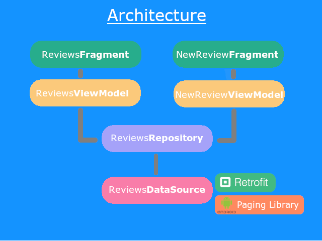
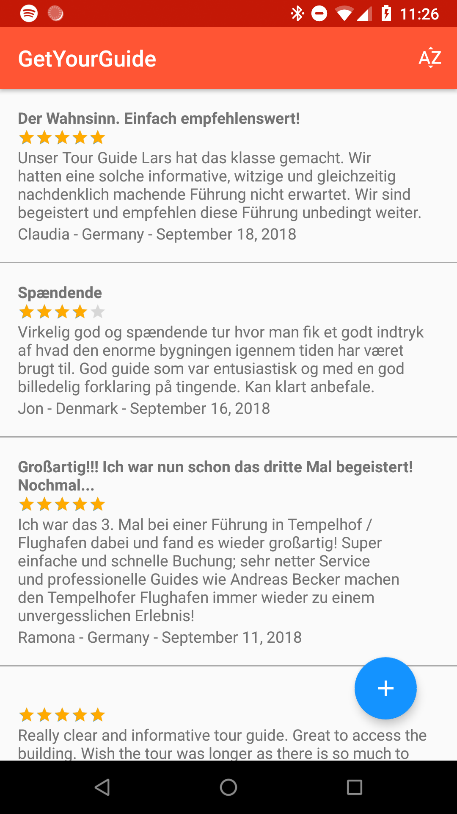
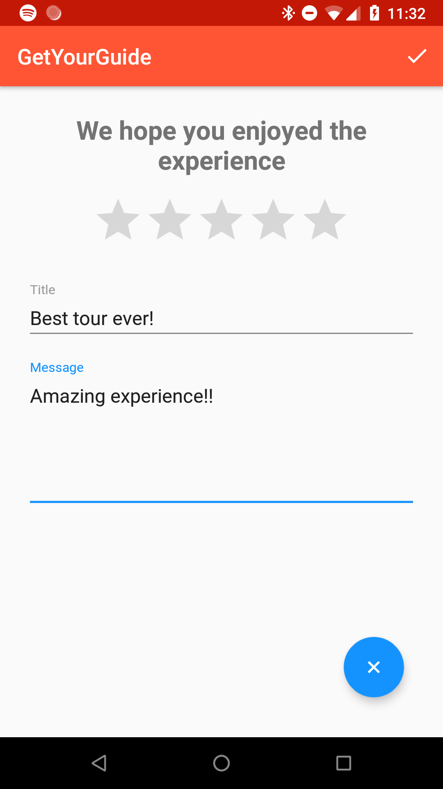

# GetYourGuide

Android take home Test from GetYourGuide

## Requirements

Create a Android app that allows a customer to browse reviews for one of their tours. Feel free to add any feature that you feel relevant to the use case.

* The app UI does not need to handle orientation changes
* No need to worry about legacy or tablet support
* The app does not need to manage user registration and/or authentication
* You’re allowed to use third-party libraries if you want
* Please use the last public stable version of Android SDK and Android Studio
* Use custom User Agent header in request

## Implementation

The app that was created contains the following features: 
* Browse all the reviews for a given tour 
* Sort reviews by "Newest date",
* Sort reviews by "Oldest date"
* Sort reviews by "Highest rating"
* Sort reviews by "Lowest rating".
* Write new review 

## Implementation Details

The architecture decided to use is MVVM using Architecture Components. It allows to unit test every layer and keep view logic and business logic independent.

This project is using repository pattern and it is caching the data only in memory. Should be easy to include other caching mechanisms as Room, Sqlite or Realm, due to the choosen architecture. Since the API allows pagination has been used "Paging Library" from Architecture Component. It helps us to load data gradually within the app's RecyclerView.

Project is also using RxJava to request the data and Dagger2 to do the dependency injection. 

The next image is a high level representation of the architecture used:

## UX/UI

Project is following Material Design guidelines. 

To display the images was used a RecyclerView. And is used a Floating action button to display the "NewReviewFragment".

### Main view:

### Details view:

## Libraries

 1. RxJava
 2. Retrofit
 3. Dagger2
 4. Paging library
 5. LiveData & ViewModel
 6. Mockito
 
 
